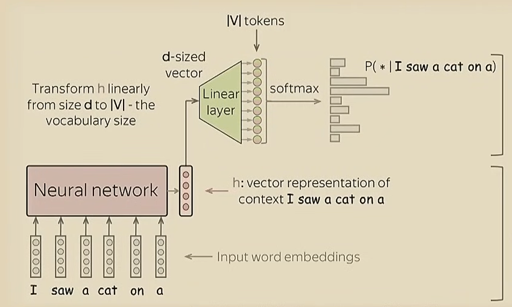
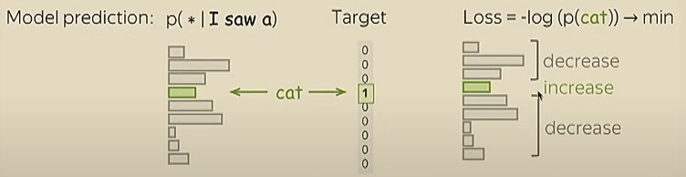
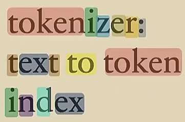

# LLM
LLM sta per Large Language Model, un language model è un modello che esegue una distribuzione delle probabilità su una sequenza di parole o token, quindi una creerà una sequenza di probabilità del tipo:
$$ p(x_1, \dots, x_n) $$
o più concretamente una cosa come:
$$ p(the, mouse, ate, the, cheese) = 0.02 \\ p(the, the, mouse, ate, cheese) = 0.0001 $$
tuttavia un LMs è un modello generativo, quindi è in grado di generare dati, quando addestriamo un LLM ciò che conta è:
- L'architettura, quindi il tipo di rete utilizzata.
- Algoritmi di training e di perdita.
- Dati, quindi i dati su cui l'LLM lavora.
- Valutazione, quindi come verifichiamo che il nostro LLM sta raggiungendo i risultati prefissati.
- Sistema.

## Autoregressive (AR) language models
Ciò che fanno gli AR LM è di prendere la distribuzione sulle parole e decomporla nella distribuzione tra la parola appena inserita e la successiva, quindi:
$$ p(x_1, \dots, x_n) = p(x_1)p(x_2 | x_1)p(x_3 | x_2, x_1)\dots = \prod_i p(x_i | x_{1:i-1}) $$
ciò che viene fatto con questi modelli è praticamente costruire un ciclo for che lavora come segue:
```
phrase = ""
for conditions
    phrase += " " + model.predict(phrase) 
```
quindi praticamente da una frase verrà prodotta la parola sucessiva, questo naturalmente porterà più tempo nella generazione.

Naturalmente al modello non gli potremmo passare le singole parole, ma piuttosto una serie di token, quindi ad ogni parola gli assegnermo un ID:
$$ She = 1, likely = 2, preferse = 3 $$
questa attività è fondamentale e prende il nome di **Tokenizzazione**.

### Struttura

La struttura di un AR LM sarà la seguente:
1. Input layer, conterrà la frase (i vari token) costruita fino a quel punto, supponiamo di essere arrivati a:
    > I saw a cat on a
    
    allora essi verranno inseriti all'interno di vettori.

2. Rete neurale, elabora i vettori in ingresso e restituisce un unico vettore che rappresenta il nostro contesto.
3. Layer lineare, riceve in ingresso il vettore in uscita dalla rete neurale e restituisce una serie di probabilità per la parola successiva.
4. Softmax, elabora le varie probabilità per la parola successiva.

### Perdita
Supponiamo che la nostra frase è arrivata a:

> I saw a 
> 
e supponiamo di voler far si che il modello dopo "I saw a" dica "cat", allora in tal caso dovremmo fare come abbiamo sempre visto nei modelli supervisionati, quindi dare l'input e confrontare l'output desiderato con l'output del modello, a quel punto applicare una funzione di perdita, la funzione di perdita che applicheremo è la **Cross-entropy loss**, quindi andremo a fare:
$$ Loss = -\log(p(cat)) -> min $$
in tal modo andremo ad aumentare la probabilità che il modello imparerà a generare "cat" e non altre parole:


### Tokenizzazione
La tokenizzazione è fondamentale per svariati motivi, ma il principale deriva proprio dalla generalizzazione, di fatti grazie ai token potremmo assumerere che:
$$ 0 = ciao = hello = hola = \dots $$
per eseguire una buona tokenizzazione in realtà non ci dobbiamo basare sulle singole parole, ma piuttosto prendere un testo e da questo partire carattere per carattere, poi man mano che vediamo che i caratteri si ripetono li andiamo ad unire in un singolo token, di seguito un esempio di tokenizzazione:

